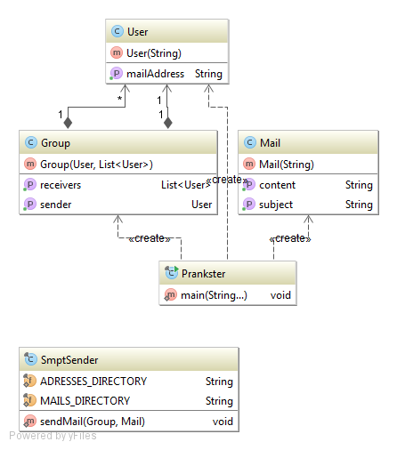

# Prankster

## Description
This program create mails from a file containing e-mail addresses and mail contents. It will create a number a group defined by the user. Each group contains at least 3 members. Each group will have one of its member
designated as the sender of the mail, while the others will receive the mail. The mail will be choose randomly amoung the multiple list of mail model files.

## Configuration
When running the program do not forget to give one argument, that is the number of groups you want to create.

### Setup
Before running the programm for the first time, be sure that:
* you have configured the **config.properties** file
* you have placed some mail models in **mails/** folder
* you wrote mail addresses in the **addressesList.txt** file in the **addresses/** folder.

More informations about the files below this section.

### config.properties
This file define the information of the smtp server to connect to.

* host : IP or name of the smtp server

* port : Port number of the smtp server

### mails/
This folder contains the files used as model for the e-mail prank. Preferably use **.txt** files. It has to respect a certain format. This first line has to be the subject of the mail. Then the rest of the file is considered as the content of the mail.

### addresses/
This folder contains the file (**addressesList.txt**) that contain the list of mails that will be used for the prank. 
You must write each address on a different line. Avoid letting any empty line, or you will get unexpected result, such as a blanck sender or receiver.

## Implementation 

The class prankster is in charge to create the users and assign them in a group. Each groups have a sender an at least two receivers. Once the groups are created, the mails will be created by the filename in which to choose the content. Once all data are ready, there are send to SmtpSender that will create the mail through smtp commands to a server.

## MockServer
If you do not want to start with sending messages to a real smtp server, you can use a fake one instead.
* First get to this page https://github.com/tweakers-dev/MockMock/archive/master.zip to get a zip of fake server, if you do not want to get a zip go there to get your sources https://github.com/tweakers-dev/MockMock
* Exctract the data from the zip
* Open a console in the root folder of the program
* Go in the release folder
* Then type "java -jar MockMock.jar"
    * If you want to use a different port that the default one add "-p *portNumber*" to your command
* You can access to the web interface at this address http://localhost:8282

And voilà, you can now send mails without distubating anyone.